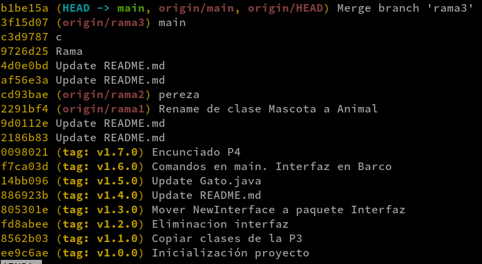
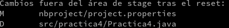
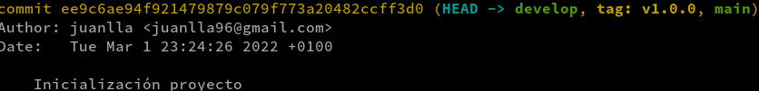
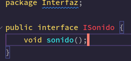
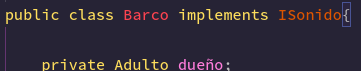
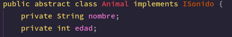
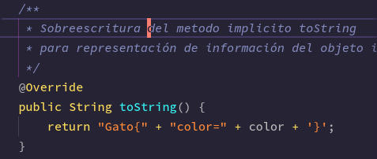

# Version System - ES

Realizado por Leslie Ross y Ezequiel De La Rosa

## Preparación

Podemos crear y posicionarnos dentro de una nueva rama con:

`git checkout -b develop`

Clonar el repositorio base

`
git@github.com:JuanLlado/Practica4.git
`

Dentro del repositorio eliminar el archivo oculto `.git` que hace referencia a estar bajo el control de versiones.

Podemos ver el historial de commits, identificadores y tags para volver atras en las versiones del proyecto.

`git log --oneline`

Podemos retroceder en las versiones del proyecto con su identificador con `git reset`.

`git reset ee9c6ae`

Si hacemos un `git log` podemos ver en que tag del proyecto nos encontramos.

## Refactorizaciones

La primera refactorizacion consiste en el borrado de una de las interfaces `NewInterface` y quitar su implementacion en la clase `Barco`.

Podemos hacer un push subiendo la rama y sus cambios.

Podemos añadirle una version a estos cambios realizados.

`git tag -a v2.0.0 -m "Creacion de interfaz ISonido"`

La segunda refactorizacion que realizaremos sera implementar la nueva interfaz a los metodos que antiguamente utilizaban la interfaz `NewInterface`.

f

Y añadir comentarios en formato Javadoc para la documentacion de metodos.

A todo se le puede añadir un tag de nueva version

`git tag -a v3.0.0 -m "Implementacion de interfaz Sonido en clase padre y documentacion de metodos"`
